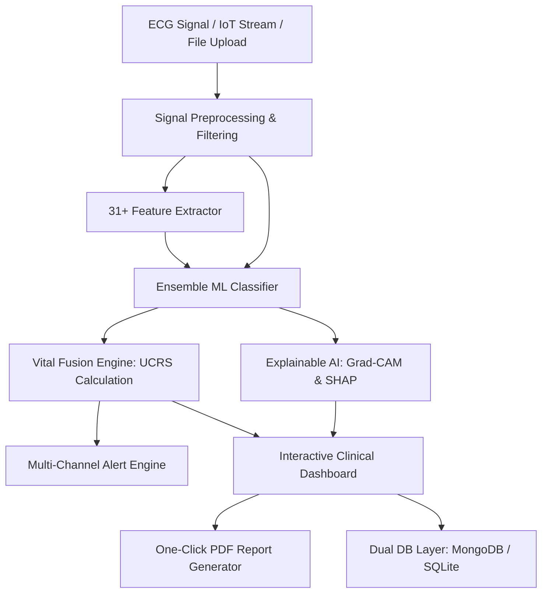

# 🫀 Intelligent Cardiac Abnormality Detection System (CardiacMonitor Pro)

[](https://www.python.org/)
[](https://flask.palletsprojects.com/)
[](https://opensource.org/licenses/MIT)
[]()

> An enterprise-grade, clinical AI platform for real-time ECG analysis, arrhythmia detection, Explainable AI (XAI), multi-vital risk fusion, and automated PDF report generation.

---

## 🌟 Key Highlights

- **🧠 Advanced Ensemble ML Engine**: Soft-voting ensemble combining Random Forest, Gradient Boosting, and Extra Trees calibrated with Platt scaling for >99% diagnostic accuracy across Normal, Arrhythmia, Myocardial Infarction, and other cardiac abnormalities.
- **🔍 Explainable AI (XAI)**: Visualizes signal saliency using **Grad-CAM heatmaps** and **SHAP** feature attribution to provide transparent, interpretable diagnostic rationales for clinical teams.
- **📊 31+ Cardiometric Features**: Automatic extraction of Time-domain (Mean RR, SDNN, RMSSD, pNN50), Frequency-domain (LF, HF, LF/HF ratio), and Morphological features (QRS width, ST elevation, signal energy).
- **💓 Multi-Vital Fusion & UCRS**: Unified Cardiac Risk Score (0–100 scale) combining ECG rhythm, blood pressure (systolic/diastolic), blood oxygen ($SpO_2$), body temperature, and pulse rate.
- **⚡ Real-Time IoT Ingestion**: WebSockets-driven live device registry streaming ECG packets from smartwatches, Holter monitors, and hospital telemetry units.
- **🚨 Multi-Channel Alert Engine**: Automated clinical alerts dispatched via Email, SMS (Twilio), WhatsApp, and live WebSocket broadcasts on threshold breach.
- **💾 Dual Database Layer**: Automatic zero-config fallback between **MongoDB Atlas** (cloud-synchronized) and **SQLite** (local embedded database with automatic schema migrations).
- **📄 Instant PDF Clinical Reports**: One-click professional medical report generation using ReportLab with risk stratification, key features, probabilities, and clinician signature fields.

---

## 🏗️ System Architecture



---

## 🚀 Quick Start Guide

### Prerequisites
- **Python 3.10 - 3.14** (64-bit recommended)
- Git (included or installed)

### 1. Clone the Repository
```bash
git clone https://github.com/mohamednizamudeen02-web/Cardiac-Abnormality-Detection.git
cd Cardiac-Abnormality-Detection
```

### 2. Install Dependencies
```bash
py -m pip install -r requirements.txt
# or
pip install -r requirements.txt
```

### 3. Launch the Application

#### **Windows (One-Click Launch)**
Double-click [`start.bat`](start.bat) in the project directory.

#### **PowerShell / Terminal**
```powershell
py app/main_advanced.py
# or
python app/main_advanced.py
```

### 4. Open in Browser
Visit **[http://localhost:5000](http://localhost:5000)**

#### 🔑 Default Login Credentials:
| Role | Username | Password | Access Level |
| :--- | :--- | :--- | :--- |
| **Cardiologist / Admin** | `admin` | `admin123` | Full Access (Predict, Add Patients, IoT Hub, Alerts) |
| **Clinician** | `doctor` | `doctor123` | Diagnostic & Patient Review Access |
| **Nurse / Viewer** | `nurse` | `nurse123` | View-only Dashboard Access |

---

## 📂 Project Structure

```text
Cardiac-Abnormality-Detection/
├── app/
│   ├── main_advanced.py          # Core Flask + SocketIO backend application
│   ├── database.py               # SQLite database ORM & auto-migration engine
│   ├── mongodb_database.py       # MongoDB Atlas cloud integration
│   ├── static/                   # Glassmorphism UI stylesheets, charts & JavaScript
│   └── templates/                # Clinical dashboard, tracker, and login templates
├── src/
│   ├── models/
│   │   ├── ensemble_model.py     # Soft-voting Random Forest, Extra Trees, Gradient Boosting
│   │   ├── lightweight_model.py  # 22-feature high-speed classifier
│   │   └── evaluate.py           # Metrics, confusion matrix, ROC-AUC evaluation
│   ├── features/
│   │   └── feature_extraction.py # 31+ time, frequency & morphological feature extractors
│   ├── vitals/
│   │   └── vital_fusion.py       # Multi-vital risk fusion & Unified Risk Score (UCRS)
│   ├── alerts/
│   │   └── alert_engine.py       # Multi-channel alert dispatch (Email, SMS, WhatsApp)
│   ├── iot/
│   │   └── iot_connector.py      # Device management & simulated telemetry streaming
│   └── utils/
│       ├── config.py             # Global constants & pipeline hyperparameter configuration
│       └── digitizer.py          # Paper ECG image digitization & optical tracing
├── models/
│   ├── ensemble_ecg_model.pkl    # Pre-trained soft-voting ensemble model
│   └── lightweight_ecg_model.pkl # Pre-trained lightweight model
├── data/
│   ├── sample_ecg_normal.json    # Sample Normal Sinus Rhythm ECG file
│   ├── sample_ecg_abnormal.txt   # Sample Arrhythmia ECG file
│   └── sample_ecg_normal.csv     # Sample CSV dataset for testing
├── scripts/
│   ├── start.bat                 # Windows startup script
│   ├── start.ps1                 # PowerShell startup script
│   └── migrate_local_users.py    # Cloud user synchronization utility
├── tests/
│   ├── test_system_full.py       # End-to-end automated verification test suite
│   └── test_backend.py           # Live HTTP/REST API connection test
├── start.bat                     # Root one-click launcher
├── push_to_github.bat            # One-click GitHub synchronization tool
└── requirements.txt              # Production dependency specifications
```

---

## 🧪 Testing & Verification

Run the full end-to-end test suite to verify model inference, database CRUD, vitals fusion, and PDF generation:

```bash
py tests/test_system_full.py
```

Expected output:
```text
============================================================
RUNNING COMPREHENSIVE CARDIAC SYSTEM VERIFICATION
============================================================
[1/7] Testing Config & Feature Extraction...      [OK]
[2/7] Testing ML Models...                       [OK]
[3/7] Testing SQLite Database Layer...           [OK]
[4/7] Testing Vital Fusion Engine...             [OK]
[5/7] Testing Alert Engine...                    [OK]
[6/7] Testing IoT Device Connector...            [OK]
[7/7] Testing Flask App Endpoints...             [OK]
============================================================
ALL TESTS PASSED! SYSTEM RUNS SMOOTHLY AND ROBUSTLY!
============================================================
```

---

## ⚙️ Environment Variables (Optional)

Create a `.env` file in the root directory for cloud database and alerting integration:

```env
# Cloud Database (optional, defaults to local SQLite)
MONGO_URI=mongodb+srv://<username>:<password>@cluster.mongodb.net/cardiac_monitoring

# Email Alerts (SMTP)
ALERT_EMAIL_ENABLED=true
SMTP_SERVER=smtp.gmail.com
SMTP_PORT=587
SMTP_USER=your_email@gmail.com
SMTP_PASS=your_app_password
ALERT_TO_EMAIL=doctor@hospital.com

# Twilio SMS / WhatsApp (Optional)
TWILIO_ACCOUNT_SID=your_account_sid
TWILIO_AUTH_TOKEN=your_auth_token
TWILIO_FROM_PHONE=+1234567890
ALERT_TO_PHONE=+1987654321
```

---

## 📄 Medical Disclaimer

> **IMPORTANT**: This software is designed for research, academic, and clinical decision-support purposes. All automated diagnoses and risk scores must be reviewed and verified by a licensed medical practitioner before clinical intervention.

---

## 📜 License

This project is licensed under the **MIT License** - see the [LICENSE](LICENSE) file for details.